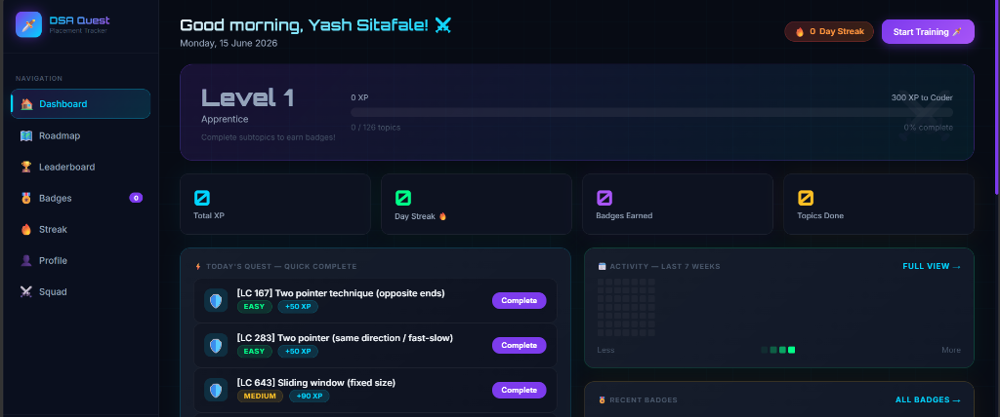
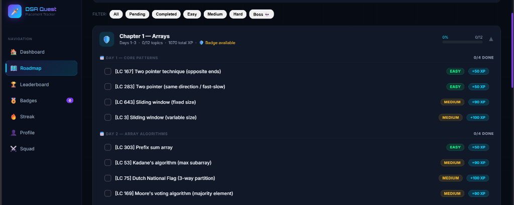
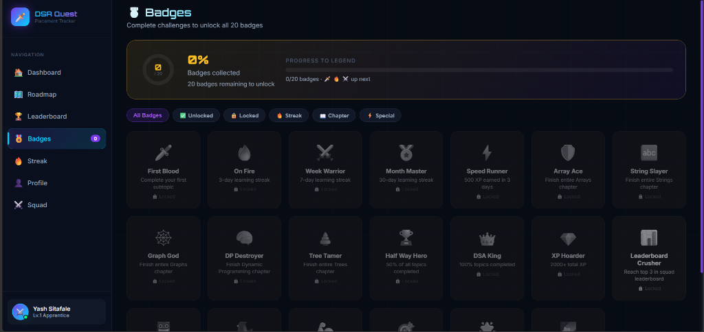

# 🗡️ DSA Quest — The Gamified Placement Arena

> **Complete DSA topics → earn XP & badges → level up → beat your friends on the leaderboard → crack placements.**

**DSA Quest** is a gamified, dark RPG-themed placement preparation tracker designed for engineering students preparing for technical placements. It transforms studying Data Structures and Algorithms (DSA) into a progressive, rewarding experience where every topic you complete earns you XP, unlocks badges, raises your level, and helps you compete with friends on a real-time leaderboard.

**Live Demo:** [https://merry-licorice-0a8df9.netlify.app](https://merry-licorice-0a8df9.netlify.app)

---

## 🎯 Project Goal

The primary goal of **DSA Quest** is to eliminate the tediousness of studying DSA by introducing gamified consistency loop patterns. By prepending LeetCode references, tracking progress on a 30-day roadmap, and introducing squad-based competitive pressure, students can build placement readiness in 15–30 days with a daily study habit.

---

## 🚀 Key Features

### 1. Curated 30-Day Roadmap (95 Subtopics)
* A comprehensive syllabus structured day-by-day covering core DSA concepts (Arrays, Strings, Recursion, Backtracking, Trees, Heaps, Greedy, Graphs, Dynamic Programming, Bit Manipulation, and Advanced Structures).
* All subtopics are prefixed with their corresponding **LeetCode Problem Number** (e.g., `[LC 167] Two pointer technique`, `[LC 146] LRU Cache design`) to bridge conceptual tracking with direct coding practice.

### 2. Accidental Completion Toggle (Sync Engine)
* Checkboxes are interactive and reversible. If you accidentally check off a subtopic as completed, clicking it again (as `✓ Done`) unselects the task.
* On unselection, the gamification engine runs a complete, synchronous recalculation of all statistics:
  * Reverts base XP and level.
  * Decrements heatmap counts.
  * Recalculates consecutive learning days and adjusts streaks.
  * Revokes progress-based achievements/badges while preserving special time-locked badges (like *Night Owl* or *Early Bird*).

### 3. Real-Time Multiplayer Squads & Leaderboard
* Create or join custom squads with unique 6-character codes to study with classmates.
* A live, database-driven leaderboard compares XP, streaks, and completion percentages.
* **Smart UI**: Hides mock placeholders when not in a squad, displays inviting CTAs to create/join, and scales podium heights/invite banners dynamically for small squads (1 or 2 members).

### 4. Achievements & level System
* Level titles scale from **Apprentice (Lv. 1)** to **DSA Legend (Lv. 7)** based on total XP.
* Unlock 20+ unique badges, including **First Blood**, **On Fire** (3-day streak), **Graph God** (Graph Chapter complete), **DP Destroyer**, and **Legend** (all badges collected).

### 5. Persistent Cloud Synchronization
* Integrated with **Firebase Authentication** for secure user login, registration, and Google OAuth signing.
* Progress is synchronized to a cloud **MongoDB Atlas** database via Netlify Serverless functions.
* Uses a debounced sync cache (1.5-second buffer) to guarantee instantaneous UI response times while keeping cloud data robustly persistent.

---

## 📸 Screenshots

### 🖥️ Dashboard View
*Shows level progression, XP tracking, daily checklist, recent achievements, and streak heatmap.*


### 🗺️ Day-by-Day Roadmap
*Interactive checklist showing LeetCode problem numbers, difficulty badges, and XP rewards.*


### 🎖️ Achievements & Badges
*Displays locked and unlocked badges along with progress rings and tooltips.*


---

## 🛠️ Technology Stack

* **Frontend**: HTML5, Vanilla CSS3 (custom dark glassmorphic design tokens), Vanilla JavaScript (ES6)
* **Authentication**: Firebase Authentication SDK (Compat version)
* **Backend**: Netlify Serverless Functions (Node.js API proxy)
* **Database**: MongoDB Atlas (Cloud Database)
* **ORM**: Mongoose

---

## 💻 Running Locally

To run the application locally alongside the serverless MongoDB backend:

1. **Clone the repository:**
   ```bash
   git clone https://github.com/YashS22Git/DSA_RewardSystem.git
   cd DSA_RewardSystem
   ```

2. **Install dependencies:**
   ```bash
   npm install
   ```

3. **Install Netlify CLI (if not installed):**
   ```bash
   npm install -g netlify-cli
   ```

4. **Run development server:**
   ```bash
   netlify dev
   ```
   This will compile local Netlify Functions and serve the frontend at `http://localhost:8888`.